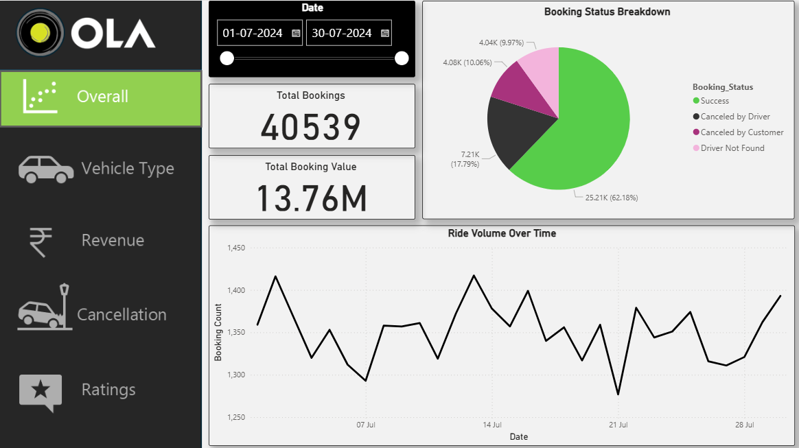
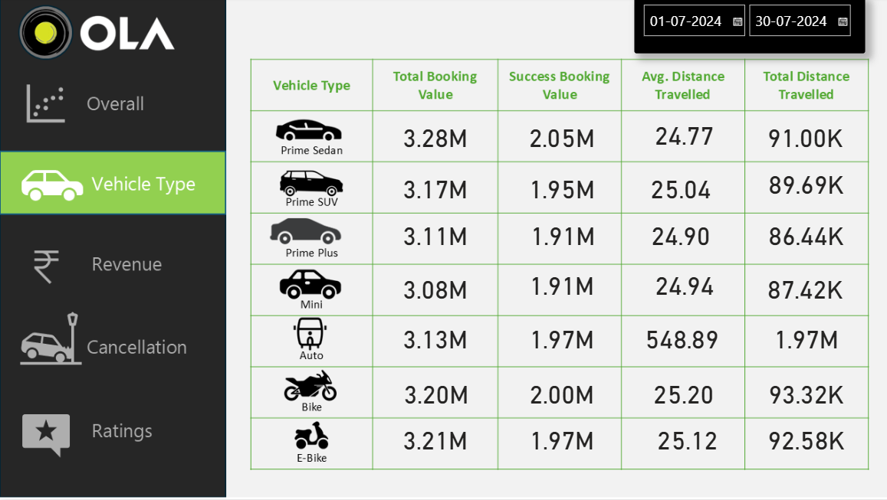
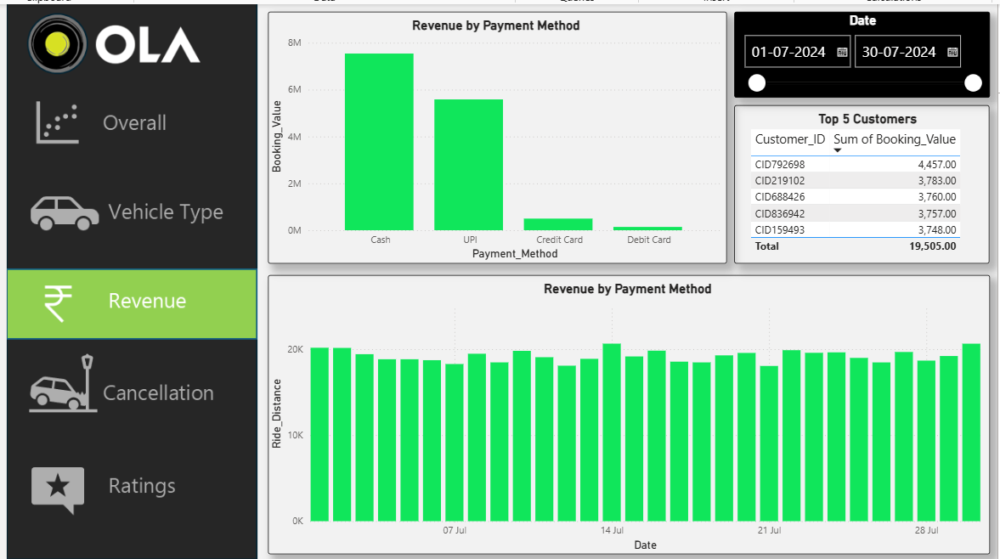
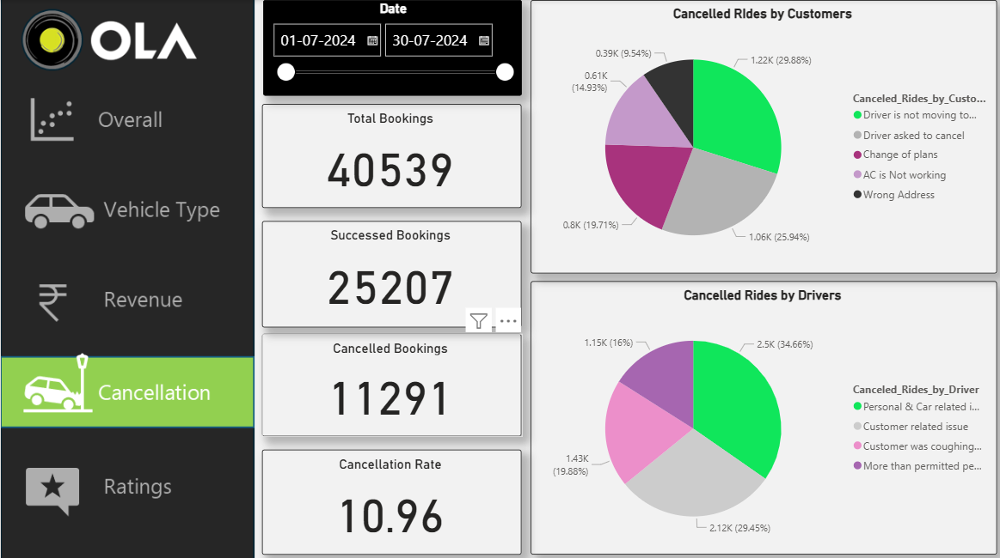
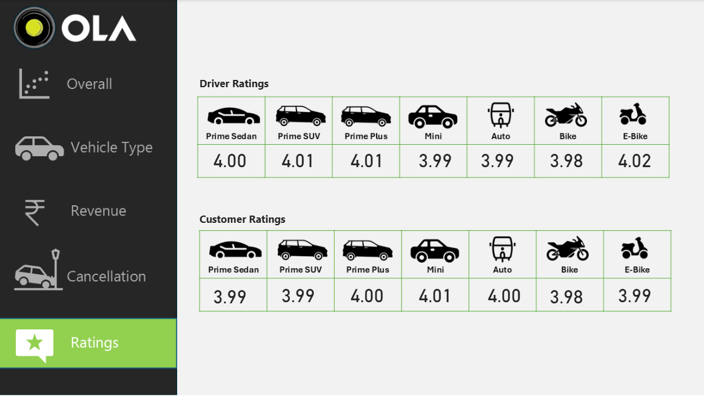

# ola_data_analytics_project

## 📌 Overview

This project delivers an end-to-end analysis of Ola ride data to uncover insights into booking behavior, operational efficiency, and customer experience. It focuses on key aspects such as ride demand trends, pickup and completion time, cancellations, revenue distribution, and service quality.

Using Python, SQL, and Power BI, the project transforms raw ride data into meaningful insights through data cleaning, exploratory analysis, and interactive dashboards. The final output is a multi-page dashboard that enables easy monitoring of performance metrics and supports data-driven decision-making.

---

## 🎯 Objective

* To analyze ride booking patterns and overall demand trends
* To evaluate driver performance based on pickup time and ride completion
* To identify and analyze cancellation behavior by customers and drivers
* To measure revenue distribution across vehicle types and payment methods
* To assess customer and driver satisfaction using ratings
* To build an interactive dashboard for clear and actionable insights

---

## 📂 Dataset

The dataset includes detailed ride-level information such as:

* Booking ID and timestamps
* Pickup and drop details
* Ride duration and distance
* Vehicle type
* Payment method
* Cancellation status (Customer/Driver)
* Customer & Driver ratings

---

## 🛠️ Tools & Technologies

* **Python (Jupyter Notebook)**

  * Pandas for data cleaning & preprocessing

* **SQL (MySQL / PostgreSQL / SQL Server)**

  * Advanced querying, aggregations, and analysis

* **Power BI**

  * Interactive dashboard and data visualization

---

## 🔍 Methodology

### 1️⃣ Data Preparation

* Imported raw dataset into Python
* Cleaned missing and inconsistent data
* Converted time-related columns for analysis

### 2️⃣ Exploratory Data Analysis (EDA)

* Analyzed ride demand over time
* Studied customer booking patterns
* Identified anomalies in ride behavior

### 3️⃣ SQL-Based Analysis

* Calculated KPIs such as total bookings, revenue, and distances
* Evaluated cancellation rates and success metrics
* Performed grouped and comparative analysis

### 4️⃣ Dashboard Development

* Designed a multi-page Power BI dashboard
* Implemented KPIs, filters, and interactive visuals

---

## 📊 Dashboard Breakdown

### 📍 Page 1: Ride Overview

* Total Booking Value
* Total Bookings
* Ride Volume Trend Over Time

### 🚘 Page 2: Vehicle Performance

* Booking Value by Vehicle Type
* Successful Booking Value
* Average Ride Distance
* Total Distance Travelled

### 💳 Page 3: Revenue & Payments

* Total Revenue Generated
* Revenue by Payment Method
* Booking Value Distribution
* Ride Distance by Payment Type

### ❌ Page 4: Cancellation Insights

* Cancellations by Customer & Driver
* Total Successful Rides
* Overall Cancellation Rate

### ⭐ Page 5: Ratings Analysis

* Customer Ratings by Vehicle Type
* Driver Ratings by Vehicle Type

---

## 📈 Key Insights

* Ride demand varies significantly over time, indicating peak usage periods
* Certain vehicle types contribute more to revenue and ride volume
* Cancellation patterns reveal operational inefficiencies
* Payment methods influence both revenue and ride distance
* Ratings highlight differences in service quality across vehicle types

---

## 📊 Dashboard Preview

* This is a dashboard of different pages. Every page show a different data about ola data analytics project.

---

## 📂 Project Files

- 📒 [Python File](https://github.com/your-username/your-repo/blob/main/notebook.ipynb)
- 🗄️ [SQL Queries](https://github.com/your-username/your-repo/blob/main/analysis_queries.sql)
- 📊 [Power BI Dashboard](https://github.com/your-username/your-repo/blob/main/dashboard.pbix)
- 🖼️ [Dashboard Image](https://github.com/your-username/your-repo/blob/main/dashboard.png)

---

## 🚀 Project Outcome

This project demonstrates the ability to:

* Work with real-world structured data
* Perform end-to-end data analysis
* Build interactive dashboards
* Generate actionable business insights

---

## 🔮 Future Enhancements

* Predict ride demand using Machine Learning
* Build real-time dashboards
* Perform customer segmentation analysis

---
